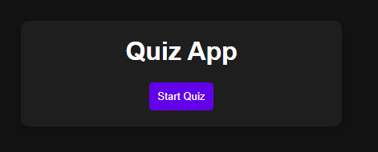
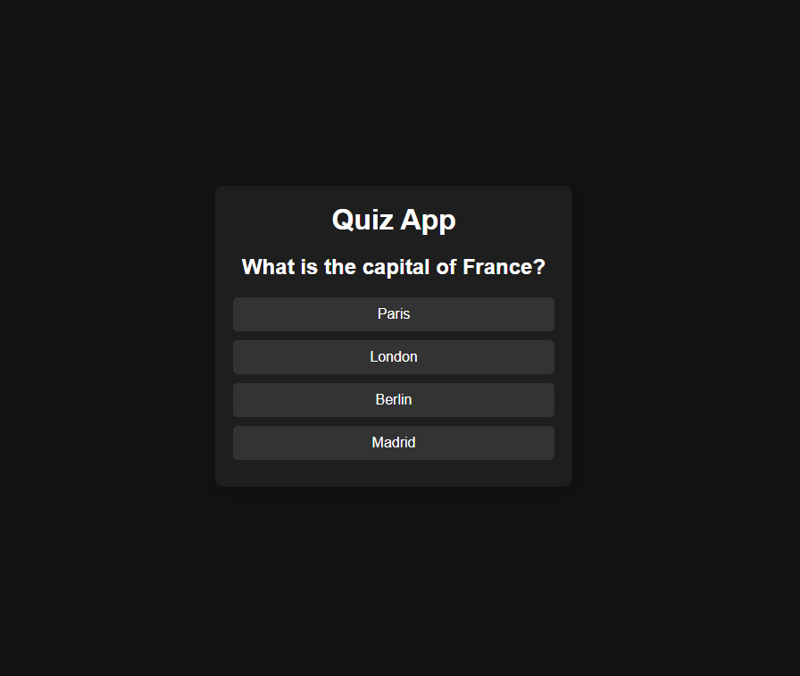
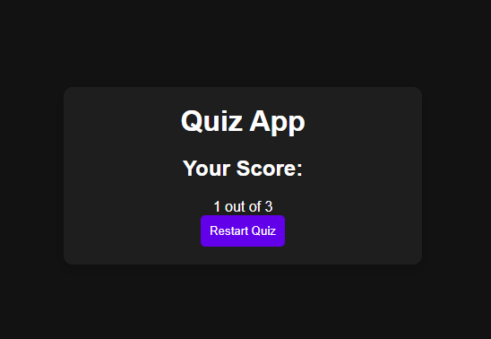

# JavaScript Quiz App

This is an interactive, client-side quiz application built from the ground up using vanilla JavaScript, HTML, and CSS. The app presents a series of multiple-choice questions, tracks the user's score, and displays the final results upon completion. It's designed to be engaging and provides a clear demonstration of core front-end development principles.

## Screenshots

Here's a visual walkthrough of the quiz application:

**Start Screen:**

**During Gameplay:**

**Final Results:**

## Features

- **Dynamic Questions:** Loads questions and answer options, allowing for easy updates or expansion of content.
- **User Interaction:** Provides immediate feedback for selected answers and clear navigation between questions.
- **Score Tracking:** Accurately calculates and keeps track of the user's score throughout the quiz.
- **Final Results Display:** Shows the total score and provides an option to restart the quiz.
- **Responsive Design:** The application is styled to be functional and visually appealing across various device screen sizes.

## Tech Stack

- **JavaScript:** Manages all quiz logic, including question presentation, answer validation, score calculation, and DOM manipulation.
- **HTML5:** Provides the foundational structure and semantic markup for the quiz elements.
- **CSS3:** Handles all styling, layout, and visual presentation, including responsive adjustments.

## Contributing

Contributions are what make the open-source community such an amazing place to learn, inspire, and create. Any contributions you make are **greatly appreciated**.

If you have a suggestion that would make this better, please fork the repo and create a pull request. You can also simply open an issue with the tag "enhancement". Don't forget to give the project a star! Thanks again!

1.  Fork the Project
2.  Create your Feature Branch (`git checkout -b feature/AmazingFeature`)
3.  Commit your Changes (`git commit -m 'Add some AmazingFeature'`)
4.  Push to the Branch (`git push origin feature/AmazingFeature`)
5.  Open a Pull Request
